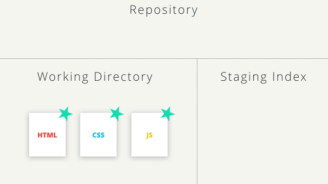
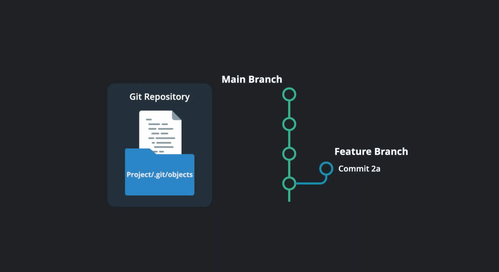
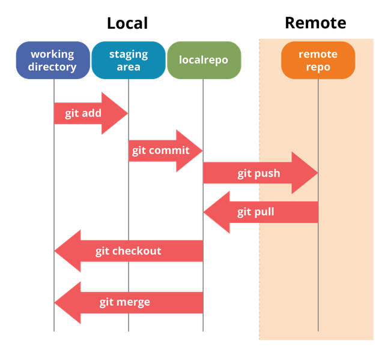
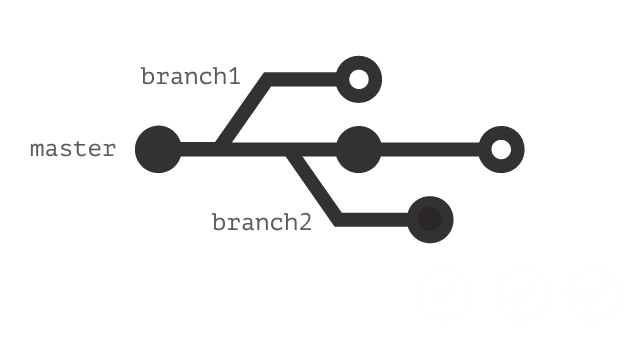
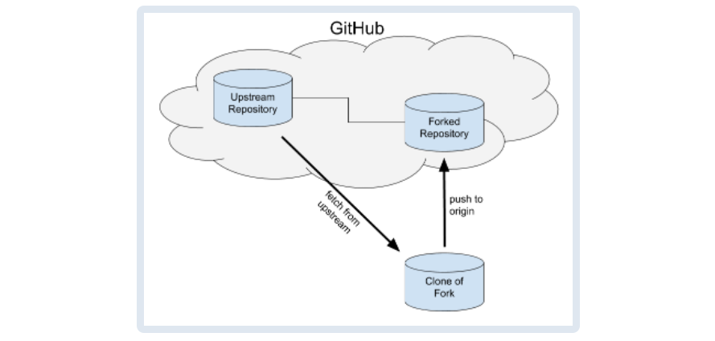
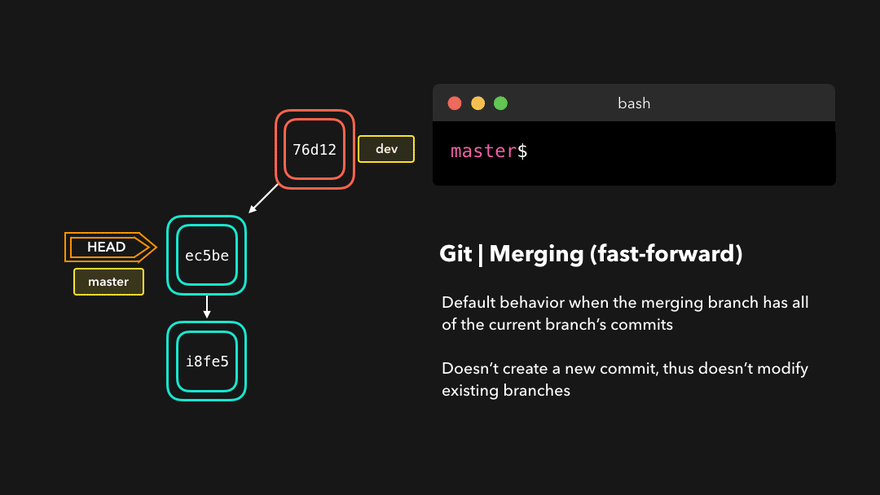
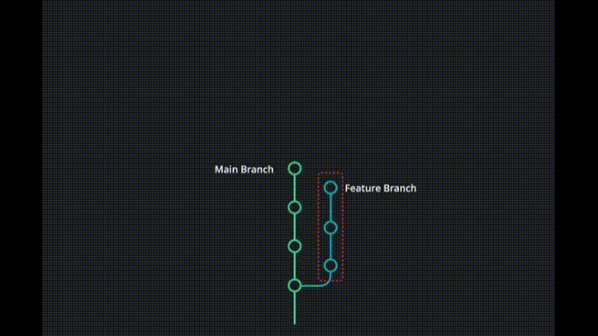

# Building A Static Website With Go Hugo

## Why this mini-series tutorial?


The main goal of this mini-series is **NOT** to teach you Web Technology, but to 
walk through the main steps for 
building a static website, and to learn to use, in the meanwhile:
- Git
- GitHub (pull request, github actions)
- [optional] Cloud Virtual Machine
- [optional] Some very useful linux commands (e.g. nohup, scp, etc.)
- [optional] Docker
- [optional] Nginx, live server, CI/CD

:rocket: :rocket: *When used as teaching material for courses (e.g. Machine Learning), 
the main focus will bu put on the ***Git*** tool and ***GitHub*** platform.*

Those skills are quite versatile and could be very useful when you create your website 
with other static web generators (e.g. Hexo, Jekyll etc.), dynamic web frameworks, 
as well as in many DevOps scenarios.

:rocket: :rocket: ***Notice: If you just want to build your own personal website, 
you need only to watch videos 1-5, whose total length is ~30 minutes.***


## Code


:rocket: All code used in the videos can be found in this repository, hosted
on GitHub as well as on Gitee.com:
- https://gitee.com/lundechen/static_website_with_go_hugo
- https://github.com/pageshu/pageshu.github.io

With the corresponding website:
- https://pageshu.github.io/

## Bilibili videos


:rocket: :rocket: ***Notice: If you just want to build your own personal website, 
you need only to watch videos 1-5, whose total length is ~30 minutes.***

- Introduction 
  - [Video 1 - Introduction](https://www.bilibili.com/video/BV1DU4y1m7NX/)
- Setup 
  - [Video 2 - Setup](https://www.bilibili.com/video/BV1JZ4y187CG/)
- Quick Start
  - [Video 3 - Quick Start](https://www.bilibili.com/video/BV1V34y1E7hy/)
- Localhost Pages
  - [Video 4 - Localhost Pages](https://www.bilibili.com/video/BV1Wv4y1A75F/)
- GitHub Pages
  - [Video 5 - Github Pages](https://www.bilibili.com/video/BV1V5411R7EM/)
- Code Collaboration with GitHub Pull Request
  - [Video 6 - GitHub Pull Request - Within One Team]()
  - [Video 7 - GitHub Pull Request - Across Teams]()
  - [Video 8 - GitHub Pull Request - Resolving Merge Conflict]()
- [Bonus] Bootstrap Pages
  - [[Bonus] Video 9 - Bootstrap Pages]()
- [optional] Cloud VM Pages 
  - [[optional] Video 10 - Cloud VM Pages](https://www.bilibili.com/video/BV1PY4y1t746/)


## Setup 

###  Install git


#### Windows
Install [git for Windows](https://gitforwindows.org/).

#### MacOS
On Mavericks (10.9) or above you can do this simply by trying to 
run git from the Terminal the 
very first time. 

```shell script
git --version
```
If you don’t have it installed already, it will prompt you to install it.

#### Linux
Git is installed by default on Linux.

### Install Go


Installation package: https://go.dev/dl/

To check if Go is installed:
```shell script
go version
```

###  Install Hugo (extended version)


#### Windows
Download [Hugo executable](https://github.com/gohugoio/hugo/releases) (extended version), 
then [add its path to environment variable](https://www.computerhope.com/issues/ch000549.htm).

#### Linux
```sudo apt -y install hugo```
#### MacOS: 
```brew install hugo```

###  Install VS Code and extensions


Install VS Code, and add those extensions: 
- Hugo Language and Syntax Support
- Live Server

## Creating Hugo website


*This section is adapted from: https://gohugo.io/getting-started/quick-start/*

### Create a New Site
```shell script
hugo new site pageshu 
```
### Add a Theme
See [themes.gohugo.io](https://themes.gohugo.io/) for a list of themes to consider. 

Other free Hugo themes:
- https://jamstackthemes.dev/ssg/hugo/
- https://cloudcannon.com/blog/top-10-hugo-themes-for-2022/

A very popular personal site theme among academic researchers:
- https://github.com/wowchemy/starter-hugo-academic

If you are willing to pay ~360RMB for buying a high-quality theme:
- https://gethugothemes.com/

This tutorial uses the beautiful [Ananke theme](https://themes.gohugo.io/themes/gohugo-theme-ananke/).

First, download the theme from GitHub and add it to your site’s themes directory:
```shell script
cd pageshu
git init
git submodule add git@github.com:theNewDynamic/gohugo-theme-ananke.git themes/ananke
# or: git submodule add https://github.com/theNewDynamic/gohugo-theme-ananke.git themes/ananke
```

Then, add the theme to the site configuration ```config.toml```:
```shell script
theme = "ananke"
```

### Add Some Content


#### Markdown language
Markdown is very simple to learn.
- https://github.com/adam-p/markdown-here/wiki/Markdown-Cheatsheet
- https://www.makeuseof.com/tag/learning-markdown-write-web-faster/

#### Create markdown file
- You can manually create content files 
(for example as ```content/<CATEGORY>/<FILE>.<FORMAT>```) 
and provide metadata in them.
- However you can use the new command to do a few things for you (like add title and date):
```shell script
hugo new posts/my-first-post.md
```

#### Start the Hugo server
Now, start the Hugo server with drafts enabled:
```shell script
hugo server -D
```
Navigate to your site at http://localhost:1313/.

#### Build static pages
It is simple. Just call:
```shell script
hugo -D
```
Output will be in ```./public/``` directory by default 
(```-d/--destination``` flag to change it, or set ```publishdir``` in the config file).


#### Using ExampleSite
If you wanna start with more content prepared already, you could 
- copy/move files and folders within ```pageshu/themes/ananke/exampleSite``` to ```pageshu/```.
- Delete line ```baseURL = "...." ``` in ```config.toml```.
- Change line ```resourceDir = "../resources"``` to ```resourceDir = "resources"```
- Change line ```theme = ["github.com/theNewDynamic/gohugo-theme-ananke"]``` to ```theme = "ananke"```


Run ```hugo server -D``` again and you have the example site.

#### Mobile version of the website


Our website should be **responsive**.

-  ```F12```
-  ```Ctrl + Shift + M```

## Serving pages on localhost 


### Live Server

```shell script
hugo -D --minify --baseURL=http://127.0.0.1:5500/public
```

On VS Code, click *Go Live* to open Live Server extension.

## Serving pages on GitHub pages


### Repository in video
In the video, I used this repository:
- https://github.com/pageshu/pageshu.github.io

The corresponding github pages:
- https://pageshu.github.io/

### SSH Keys for GitHub


You can refer to those blogs for how to generate public rsa id and copy it the 
GitHub. In this manner, your machine can communicate with GitHub server via 
ssh protocol instead of HTTPS, and you won't need to provide your GitHub account and
password each time.

- https://jdblischak.github.io/2014-09-18-chicago/novice/git/05-sshkeys.html

- https://www.w3docs.com/snippets/git/how-to-generate-ssh-key-for-git.html

```shell script
ssh-keygen
```

### Create ```.gitignore``` file


```.gitignore``` tells git which files (or patterns) it should ignore. It's usually used to avoid committing transient files from your working directory that aren't useful to other collaborators, such as compilation products, temporary files IDEs create, etc.


```text
.idea
.vscode
public
resources/_gen/
.DS_Store
node_modules
dist
tmp
*.lock
```

### Git add 




```shell script
git add .
```


### Git commit


A commit is a snapshot of your git repository at one point in time and each commit cumulatively forms your repo history.

```shell script
git commit -m "source code for hugo website"
```


### Push you code to GitHub


Create a github repository ```<YOUR-GITHUB-USER-NAME-OR-ORGANIZATION-NAME>.github.io```, e.g. ```pageshu.github.io```. Note that 
```<YOUR-GITHUB-USER-NAME-OR-ORGANIZATION-NAME>``` should be unique and has not been used by other GitHub users or organizations.

Push you code to GitHub:
```shell script
git remote add origin git@github.com:<YOUR-GITHUB-USER-NAME-OR-ORGANIZATION-NAME>/<YOUR-GITHUB-USER-NAME-OR-ORGANIZATION-NAME>.github.io.git
git push -u origin master
```

### Create a new branch


Creating a new branch ```gh-pages``` in GitHub:
```shell script
git checkout --orphan gh-pages
git rm -rf .
git commit --allow-empty -m "create empty gh-pages branch"
git push origin gh-pages
git checkout master
```

### Github Actions


The notion of Github Actions is closely related to
CI/CD (Continuous Integration & Continuous Deployment).


In order for the GitHub action to deploy the website, a GitHub 
[deploy key](https://docs.github.com/en/developers/overview/managing-deploy-keys) 
must be registered.

To do so, create a new SSH key pair on your machine like with the command line:

```shell script
ssh-keygen
```

In the prompt input the file name (or, the path) for your key,
e.g. ```rsa_pageshu```. Then strike ```Enter``` on the keyboard for twice.

This will create two files, the public key (```rsa_pageshu.pub```) 
and the private key (```rsa_pageshu```). 

Go to 
https://github.com/<YOUR-GITHUB-USER-NAME-OR-ORGANIZATION-NAME>/<YOUR-GITHUB-USER-NAME-OR-ORGANIZATION-NAME>.github.io.git/settings/keys 
and click "Add deploy key". 
Paste in the public part of your key pair and check the "Allow write access" box.

Then, go to 
https://github.com/<YOUR-GITHUB-USER-NAME-OR-ORGANIZATION-NAME>/<YOUR-GITHUB-USER-NAME-OR-ORGANIZATION-NAME>.github.io.git/settings/secrets 
and click "Add new secret". Choose ACTIONS_DEPLOY_KEY as the name and paste the private part of your key pair into the "Value" field.

With the key in place, it’s time to set up the actual GitHub Actions workflow. 
This is simply done by creating the file *.github/workflows/main.yml* 
in your repository with the following contents.

```yaml
name: pageshu

on:
  push:
    branches:
    - master

jobs:
  build-deploy:
    runs-on: ubuntu-20.04
    steps:
    - uses: actions/checkout@master
      with:
        submodules: true

    - name: Setup Hugo
      uses: peaceiris/actions-hugo@v2
      with:
        hugo-version: '0.86.0'
        extended: true

    - name: Build
      run: hugo --minify --baseURL=https://<YOUR-GITHUB-USER-NAME-OR-ORGANIZATION-NAME>.github.io

    - name: Deploy
      uses: peaceiris/actions-gh-pages@v3
      with:
        deploy_key: ${{ secrets.ACTIONS_DEPLOY_KEY }}
        publish_branch: gh-pages
        publish_dir: ./public
        allow_empty_commit: true
```

Once your workflow completed, you can see new commits 
on the GitHub pages repository master branch 
and in few minutes the changes will appear on your GitHub page URL.

## Code collaboration via GitHub Pull Request

### If you are on Solo mode




### If you work with other developers




### A very good tutorial by Ms. Sun Hudie

:rocket: :rocket: :rocket:  A very good tutorial :point_right: :[分支创建+pr-by孙胡蝶.docx](分支创建+pr-by孙胡蝶.docx).

### VS Code extension

Install *Git History* extension on your VS Code.

Other alternatives: *Git Graph* extension.


### General Principle

There are different pull requests workflows with different styles, but the general process is as follows:

- 1. A developer creates the feature in a dedicated branch in their local repo.

- 2. The developer pushes the branch to a GitHub repository.

- 3. The developer files a pull request via GitHub.

- 4. The rest of the team reviews the code, discusses it, and alters it.

- 5. The project maintainer merges the feature into the official repository and closes the pull request.


### Within One Team (i.e. you have write access to the repo)


#### Create and push new branch 


```shell script
# Checkout the master branch - you want your new branch to come from master
git checkout master

# Create a new branch named newfeature (give your branch its own simple informative name)
# Switch to your new branch
git checkout  -b newfeature

git add .
git commit -m "new feature"

# Pull first, then rebase
git checkout master
git pull origin master
git checkout newfeature
git rebase master # or, git merge master

# push 
git push origin newfeature
```

#### Submit Pull Request


#### Merge ```newfeature``` branch


### Cross Team (i.e. you don't have write access to the repo)
Reference:
- *https://gist.github.com/Chaser324/ce0505fbed06b947d962*

Whether you're trying to give back to the open source community 
or collaborating on your own projects, 
knowing how to properly fork and generate pull requests is essential. 


#### Simple Mode

Fork -> Code Modification -> Push -> Pull Request


#### A better but more sophisticated procedure 

The following subsections depict the fairly "standard" (better but more complicated) procedure for creating a fork, 
doing your work, issuing a pull request, 
and merging that pull request back into the original project.

#### Creating a Fork

Just head over to the GitHub page and click the "Fork" button. 
It's just that simple. Once you've done that, 
you can use clone your repo with command line:

```shell script
# Clone your fork to your local machine
git clone git@github.com:<FORKER-USERNAME>/<FORKED-PROJECT>.git
```

#### Create a Branch
Whenever you begin work on a new feature or bugfix, 
it's important that you create a new branch. Not only is 
it proper git workflow, but it also keeps your changes 
organized and separated from the master branch so that 
you can easily submit and manage multiple pull requests 
for every task you complete.

```shell script
# Checkout the master branch - you want your new branch to come from master
git checkout master

# Create a new branch named newfeature (give your branch its own simple informative name)
# Switch to your new branch
git checkout  -b newfeature
```

Now, go to town hacking away and making whatever changes you want to.

#### Cleaning Up Your Work


Prior to submitting your pull request, 
you might want to do a few things to clean up your branch and make 
it as simple as possible for the original repo's maintainer 
to test, accept, and merge your work.

Merge vs rebase:
https://www.atlassian.com/git/tutorials/merging-vs-rebasing

```shell script
# Add 'upstream' repo to list of remotes
git remote add upstream https://github.com/<UPSTREAM-USER>/<ORIGINAL-PROJECT>.git

# Verify the new remote named 'upstream'
git remote -v

git add .
git commit -m "new feature"

# Fetch upstream master and merge with your repo's master branch (pull = fetch + merge)
git checkout master
git pull upstream master

# If there were any new commits, rebase your development branch
git checkout newfeature
git rebase master # or, git merge master
```

#### Submitting your Pull Request

Once you've committed and pushed all of your changes to GitHub, 
go to the page for your fork on GitHub, select your development branch, 
and click the pull request button. If you need to make any adjustments 
to your pull request, just push the updates to GitHub. Your pull request 
will automatically track the changes on your development branch and update.

#### Accepting and Merging a Pull Request



Take note that unlike the previous sections which were written from 
the perspective of someone that created a fork and generated a pull request, 
this section is written from the perspective of the original 
repository owner who is handling an incoming pull request.
Thus, where the "forker" was referring to the original repository as ```upstream```, 
we're now looking at it as the owner of that original repository and the standard ```origin``` remote.


#### Automatically Merging a Pull Request

In cases where the merge would be a simple fast-forward, 
you can automatically do the merge by just clicking the 
button on the pull request page on GitHub.

#### Manually Merging a Pull Request

To do the merge manually, you'll need to checkout 
the target branch in the source repo, pull directly 
from the fork, and then merge and push.

```shell script
# Checkout the branch you're merging to in the target repo
git checkout master

# Pull the development branch from the fork repo where the pull request development was done.
git pull https://github.com/<FORK-USERNAME>/<FORKED-PROJECT>.git newfeature

# Merge the development branch
git merge newfeature

# Push master with the new feature merged into it
git push origin master
```

Now that you're done with the development branch, you're free to delete it.

```shell script
git branch -d newfeature
```

### Resolving merge conflict 

The — no-ff option is useful when you want to have a clear notion of your feature branch. 
So you treat a feature branch with a bunch of commits as a single unit, 
and merge them as a single unit. It is clear from your history when you do feature branch merging with — no-ff.

Those are scenarios where Conflicts could happen:


```shell script
git merge
```




```shell script
git rebase
```




```shell script
git pull
```


And here is how to fix it:


##  [optional] Serving pages on Cloud Virtual Machine


### Buy and connect to cloud VM


I have made a video explaining how :point_down: :
- https://www.bilibili.com/video/BV1nZ4y1k7Nr/

:point_up: 没有使用过云虚拟机的同学，先看下这个视频学习一下。

### Copy files to Cloud VM
Copy files to Cloud VM:
```shell script
scp -r ../pageshu root@116.205.139.7:~/ # use Git Bash
ssh root@116.205.139.7
git submodule update --recursive
```

### Hugo server, from the Cloud VM
```shell script
sudo nohup hugo server --bind=192.168.0.61 --baseURL=http://116.205.139.7 -p 8108 >> ~/nohup.txt &
```

### Docker

I made a video explaining the what and how of Docker:
- video: https://www.bilibili.com/video/BV1kL4y1g7Xd/
- corresponding website: https://docker-curriculum.com/

### Nginx


```shell script
ssh root@116.205.139.7
cd pageshu
sudo hugo --minify --baseURL=http://116.205.139.7:8818
cd public
touch Dockerfile
```

Add following lines into Dockerfile (```vi Dockerfile```):
```shell script
FROM nginx:latest
COPY . /usr/share/nginx/html/
```

Build docker image and run docker container:
```shell script
sudo docker build -t pageshuimage .
sudo nohup docker run -it --rm -d -p 8818:80 --name pageshucontainer pageshuimage > ~/pageshu.txt &
```

Now, you can visit the website at: http://116.205.139.7:8818


## Conclusion


